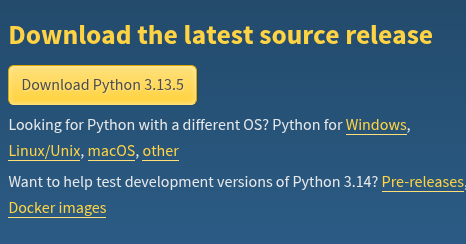

# PYTHON DASAR
python merupakan bahasa pemograman dimana bahasa ini adalah bahasa interpreter(di terjemah) hanya saja bisa juga di compiler, bahasa pemograman ini sangat luas sekali penggunaan nya
**bisa untuk**
- Web development(django, flask)
- mobile apps
- Desktop apps
- Data science
- Machine learning
- artificial inteligent(ai)


# Cara menginstall persiapkan diri untuk python
cukup download saja python disini [Download](https://www.python.org/downloads/)<br>
<br>
> untuk pengguna windows setelah download tinggal klik saja hasil download nya dan selesaikan instalasi nya

## untuk mengetes apakah python nya sudah terinstall gunakan perintah di bawah ini di terminal

**di windows**
```bash
python --version
```


**jika hasilnya seperti dibawah ini maka telah terinstall**
```bash
Python 3.13.5
```

## Perintah dasar
Berikut perintah perintah dasar di python
- print() = untuk menampilkan output 
- menggunakan # untuk komentar

# Cara menjalankan program python
cara menjalankan program python terbagi menjadi 2 yaitu dengan interpreter dan compiler

1. menggunakan interpreter
cara nya sangat mudah anda tinggal buka terminal anda dan masuk ke directory working area anda dan tinggal jalankan seperti ini <br>
**di windows**
```bash
python namaProgram.py
```
**contoh**
```bash
python main.py
```

2. Menggunaakn compiler
kadang jika program python kita sudah sangat besar maka waktu unutk menjalankan nya ingin lebih cepat maka menggunakan compiler <br>
**di windows**
```bash
python -m py_compile namaProgram.py
```
**contoh**
```bash
python -m py_compile main.py
```

## Setelah itu akan muncul folder dan file seperti ini


**Masuk terlebih dahulu ke dalam folder dengan perintah**
```bash
cd __pycache__
```

**Setelah itu jalankan perintah python**
```bash
python main.cpython-313.pyc
```

> Catatan : Dalam menjalankan program python ini jika program anda sudah sangat besar di sarankan untuk menggunakan cara compiler agar lebih cepat

# Variabel
di dalam python pembuatan python sangat mudah karna tidak memelukan keyword tambahan seperti di bahasa pemograman lain serta tidak perlu deklarasi tipe data nya

## Penamaan variabel
dalam penamaan varibel ada beberapa aturan dalam pembuatan namanya
<table>
    <tr>
        <th>Contoh</th>
        <th>Konfirmasi</th>
        <th>Keterangan</th>
    </tr>
    <tr>
        <td>10judul</td>
        <td>Tidak boleh</td>
        <td>dalam pembuatan variabel tidak boleh di awali number</td>
    </tr>
    <tr>
        <td>judul10</td>
        <td>boleh</td>
        <td>salah satu contoh yang benar karna number tidak boleh di awal nama variabel</td>
    </tr>
    <tr>
        <td>judul</td>
        <td>boleh</td>
        <td>Seperti pembuatan variabel pada umumnya</td>
    </tr>
    <tr>
        <td>judul Belakang</td>
        <td>tidak boleh</td>
        <td>Tidak boleh ada spasi</td>
    </tr>
    <tr>
        <td>judul-belakang</td>
        <td>tidak boleh</td>
        <td>Tidak boleh menggunakan min(-) karna di dalam python tanda tersebut di gunakan dalam operator aritmatika yaitu pengurangan</td>
    </tr>
    <tr>
        <td>judulBelakang</td>
        <td>boleh</td>
        <td>Disarankan jika ingin menggunakan 2 kalimat menggunakan camel case</td>
    </tr>
    <tr>
        <td>judul_belakang</td>
        <td> boleh</td>
        <td>Boleh memakai underscore untuk menyambung 2 kalimat dalam penamaan variabel</td>
    </tr>
</table>

## Cara penggunaan
```python
nama = "Nugie kurniawan"
print(nama)
```

## Hasil
```bash
Nugie kurniawan
```

> Catatan : Perhatikan dalam penamaan variabel agar sesuai dengan apa yang akan di tampung oleh variabel tersebut

# Tipe Data
tipe data merupakan tipe dari sebuah nilai values nya ada beberapa tipe data utama di python 

## Integer
integer merupakan tipe data untuk angka bilangan bulat

### Cara Penggunaan
```python
angka = 99
print(angka)
```

### Hasil
```
99
```
## Float
Float merupakan tipe data angka untuk bilangan desimal(pecahan)

### Cara penggunaan
```python
phi = 3.14
print(phi)
```

### Hasil
```
3.14
```

## String
String merupakan tipe data untuk kumpulan huruf dan angka

### Cara pengunaan
```python
nama = "Nugie kurniawan"
print(nama)
```

### Hasil
```
Nugie kurniawan
```

## Boolean
tipe data boolean merupakan tipe data yang hanya berisi 2 nilai yaitu True atau False

### Cara Pengunaan
```python
ganteng = True
print(ganteng)
```

### Hasil
```
True
```

## (Bonus) tipe data di bahasa C
di dalam python kita juga dapat menggunakan tipe data dari bahasa C karna python sendiri di buat dengan bahasa C

### Cara pengunaan
```python
# pertama kita harus import dulu modul nya
from ctypes import c_double

data_double = c_double(3.5)
print(data_double.value)
```

### Hasil
```
3.5
```

# Casting(konversi tipe data)
Casting adalah sebuah istilah khusus untuk konversi(mengubah tipe data) tipe data di python 

## Int(Integer)
- int->float = akan dikonversi tipe data float contoh 8.0
- int->string = akan dikonversi sebuah text string "8"
- int->boolean = akan dikonversi False jika integer nya adalah 0 selain 0 akan True

### Cara Penggunaan
```py
print("====INTEGER====")
data_awal = 0
print("data awal = ",data_awal,", tipe data = ",type(data_awal))

data_float = float(data_awal)
data_str = str(data_awal)
data_boolean = bool(data_awal)

print("data = ",data_float,", tipe data = ", type(data_float)) # akan di ubah menjadi float contoh 10.0
print("data = ",data_str,", tipe data = ", type(data_str)) # akan di ubah menjadi text string
print("data = ",data_boolean,", tipe data = ", type(data_boolean)) #akan menjadi true kecuali jika 0
```

### Hasil
```
====INTEGER====
data awal =  0 , tipe data =  <class 'int'>
data =  0.0 , tipe data =  <class 'float'>
data =  0 , tipe data =  <class 'str'>
data =  False , tipe data =  <class 'bool'>
```

## Float
- float->int = akan di konversi menjadi int **contoh 5**
- float->str = akan di konversi menjadi text "5"
- float->bool = akan di konversi menjadi False jika di isi dengan 0 selain 0 akan menjadi True

### Cara penggunaan
```py
print("====FLOAT====")
data_awal = 8.9
print("data awal = ",data_awal,", tipe data = ",type(data_awal))

data_int = int(data_awal)
data_str = str(data_awal)
data_boolean = bool(data_awal)

print("data = ",data_int,", tipe data = ", type(data_int)) # akan di ubah menjadi Int contoh 8
print("data = ",data_str,", tipe data = ", type(data_str)) # akan di ubah menjadi text string
print("data = ",data_boolean,", tipe data = ", type(data_boolean)) #akan menjadi true kecuali jika 0
```

### Hasil
```
====FLOAT====
data awal =  8.9 , tipe data =  <class 'float'>
data =  8 , tipe data =  <class 'int'>
data =  8.9 , tipe data =  <class 'str'>
data =  True , tipe data =  <class 'bool'>
```

## Bool(BOOLEAN)
- bool->int = akan di konversi menjadi int jika nilai bool nya True maka akan menghasilkan 1 dan jika False akan menghasilkan 0
- bool->float = akan di konversi menjadi float jika nilai bool nya True maka akan menghasilkan 1.0 dan jika False akan menghasilkan 0.0
- bool->str = akan di konversi menjadi text string saja

### Cara penggunaan
```py
print("====BOOLEAN====")
data_awal = False
print("data awal = ",data_awal,", tipe data = ",type(data_awal))

data_int = int(data_awal)
data_str = str(data_awal)
data_float = float(data_awal)

print("data = ",data_int,", tipe data = ", type(data_int)) # jika True akan menghasilkan int 1 jika false akan menghasilkan int 0
print("data = ",data_str,", tipe data = ", type(data_str)) # akan di ubah menjadi text string
print("data = ",data_float,", tipe data = ", type(data_float)) # jika True akan menghasilkan float 1.0 jika false akan menghasilkan 0.0
```

### Hasil
```
====BOOLEAN====
data awal =  False , tipe data =  <class 'bool'>
data =  0 , tipe data =  <class 'int'>
data =  False , tipe data =  <class 'str'>
data =  0.0 , tipe data =  <class 'float'>
```

## Str(String)
- str->int = akan dikonversi menjadi int jika string nya berupa angka jika string berupa huruf maka akan error
- str->float = akan di konversi menjadi float jika string nya berupa angka jika string berupa huruf maka akan error
- str->bool = akan di konversi menjadi bool jika string tersebut ada isinya akan menghasilkan true dan jika string kosong akan menghasilkan false

### Cara penggunaan
```py
print("====STRING====")
data_awal = "30"
print("data awal = ",data_awal,", tipe data = ",type(data_awal))

data_int = int(data_awal) 
data_boolean = bool(data_awal)
data_float = float(data_awal)

print("data = ",data_int,", tipe data = ", type(data_int)) # jika string nya adalah berupa angka akan terkonversi menjadi int kecuali jika string nya adalah huruf akan error
print("data = ",data_boolean,", tipe data = ", type(data_boolean)) # jika string nya di isi akan menghasilkan true jika berupa string kosong maka akan menjadi false
print("data = ",data_float,", tipe data = ", type(data_float)) # jika string nya adalah berupa angka akan terkonversi menjadi float kecuali jika string nya adalah huruf akan error
```

### Hasil
```
====STRING====
data awal =  30 , tipe data =  <class 'str'>
data =  30 , tipe data =  <class 'int'>
data =  True , tipe data =  <class 'bool'>
data =  30.0 , tipe data =  <class 'float'>
```

> Catatan : Berhati hati lah jika mau casting tipe data karna bukan hanya tipe data nya saja yang berubah isinya(**nilai**) juga akan menyesuaikan dengan konversi tipe data nya

# input
input merupakan sebuah fungsi bawaan dari python yang berfungsi untuk user bisa menginputkan langsung nilai langsung dari keyboard

## Str(string)
secara default inputan itu akan menghasilkan string

### Cara penggunaan 
```py
nama = input("Masukkan nama anda : ") # jika inputan biasa itu apapun nilai nya akan di konversi jadi string
print("String  = ",nama," ada ",len(nama)," karakter") # fungsi len untuk menghitung berapa banyak karakter dari string
```

### Hasil
```
Masukkan nama anda : Nugie kurniawan
String  =  Nugie kurniawan  ada  15  karakter
```

## int(Integer)
jika kita hanya ingin inputkan itu akan menghasilkan string maka kita wajib casting inputan tersebut menjadi int

### Cara penggunaan
```py
# int
integer = int(input("Masukkan angka integer : ")) # menggunakan casting int untuk bisa inputan nya hanya angka
print("Integer = ",integer)
```

### Hasil
```
Masukkan angka integer : 5
Integer =  5
```

## float
jika ingin inputan nya menghasilkan nilai float maka kita juga harus casting inputan tersebut dengan fungsi float

### Cara penggunaan
```py
# float
floates = float(input("Masukkan angka float : ")) # menggunakan casting float untuk bisa inputan nya di isi angka float
print("float = ",floates)
```

### Hasil
```
Masukkan angka float : 2.3
float =  2.3
```

## bool(Boolean)
jika kita ingin inputan nya hasilnya menjadi nilai boolean alangkah lebih baik nya kita memberi dulu casting dengan int baru casting bool karna hanya int yang konsisten terhadap nilai boolean

### Cara penggunaan
```py
# bool
boolean = bool(int(input("Masukkan angka (1/0) : ")))
print("bool = ",boolean)
```

### Hasil
```
Masukkan angka (1/0) : 0
bool =  False
```

> Catatan : casting pada inputan ini hanya akan mempengaruhi **nilai** nya saja untuk proses dari inputan nya masih tetap bebas menginputkan apapun

# Operator logika
operator logika merupakan operator yang bertugas untuk memanipulasi tipe data boolean

**daftar operator logika**
<table>
    <tr>
        <th>Simbol</th>
        <th>nama Simbol</th>
    </tr>
    <tr>
        <td>not</td>
        <td>not(tidak)</td>
    </tr>
    <tr>
        <td>or</td>
        <td>or(atau)</td>
    </tr>
    <tr>
        <td>and</td>
        <td>and(dan)</td>
    </tr>
    <tr>
        <td>^</td>
        <td>xor</td>
    </tr>
</table>

## NOT(kebalikan)
not dalam operator logika berfungsi untuk membalikan nilai boolean jika true akan menjadi false dan jika false akan menjadi true

### Cara penggunaan
```py
# not
a = True
c = not a

print("========NOT========")
print("Nilai awal = ",a)
print('NOT')
print("Nilai akhir = ",c)
```

### Hasil
```
========NOT========
Nilai awal =  True
NOT
Nilai akhir =  False
```

## OR (atau)
or dalam operator logika bisa di lakukan jika minimal ada 2 atau lebih boolean, untuk or akan bernilai true jika minimal saja salah satu true akan menghasilkan true

### Cara penggunaan
```py
# or (akan true jika minimal salah satu true)
a = True
b = False
c = a or b

print("========OR========")

print(a," OR ",b," = ",c)
a = True
b = True
c = a or b

print(a," OR ",b," = ",c)
a = False
b = True
c = a or b

print(a," OR ",b," = ",c)
a = False
b = False
c = a or b

print(a," OR ",b," = ",c)
```

### Hasil
```
========OR========
True  OR  False  =  True
True  OR  True  =  True
False  OR  True  =  True
False  OR  False  =  False
```

## AND(dan)
and dalam operator logika akan bisa di gunakan jika terdapat 2 atau lebih nilai boolean, and akan bernilai true jika kedua nilai nya adalah true

### Cara penggunaan
```py
# and (akan true jika kedua nya adalah true)
a = True
b = False
c = a and b

print("========AND========")

print(a," AND ",b," = ",c)
a = True
b = True
c = a and b

print(a," AND ",b," = ",c)
a = False
b = True
c = a and b

print(a," AND ",b," = ",c)
a = False
b = False
c = a and b

print(a," AND ",b," = ",c)

```

### Hasil
```
========AND========
True  AND  False  =  False
True  AND  True  =  True
False  AND  True  =  False
False  AND  False  =  False
```

## XOR
XOR dalam operasi logika dapat di gunakan jika minimal ada 2 atau lebih nilai boolean, xor akan bernilai true jika kedua nilai nya berbeda akan menghasilkan true

### Cara penggunaan
```py
# xor (akan true jika salah satu harus true dan satunya lagi harus false)
a = True
b = False
c = a ^ b

print("========XOR========")

print(a," XOR ",b," = ",c)
a = True
b = True
c = a ^ b

print(a," XOR ",b," = ",c)
a = False
b = True
c = a ^ b

print(a," XOR ",b," = ",c)
a = False
b = False
c = a ^ b

print(a," XOR ",b," = ",c)

```

### Hasil
```
========XOR========
True  XOR  False  =  True
True  XOR  True  =  False
False  XOR  True  =  True
False  XOR  False  =  False
```

> Catatan : untuk xor sebenernya bukan operator logika murni melainkan operator bitwise.